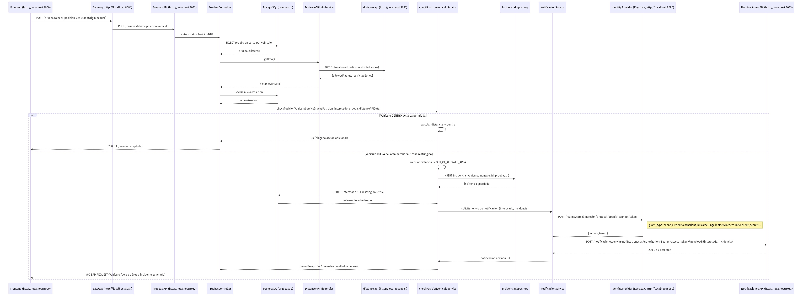

Sistema de microservicios para dar soporte a la gestion de alquiler de autos. Proyecto final de la catedra de Backend de Aplicaciones, Universidad Técnologica Nacional, Facultad Regional Córdoba.

## Getting Started
Ejecutar la infraestructura de microservicios con el comando

```bash
docker compose up
```

Agregar "identity.provider" a la lista de hostsnames en /etc/hosts

---

## Arquitectura


## Diagrama: flujo `/pruebas/check-posicion-vehiculo` ✅
A continuación se muestra el diagrama de secuencia cuando el vehículo está fuera del área permitida (se genera una incidencia y se envía una notificación):



Fuente (Mermaid): `diagrams/check_posicion_vehiculo.mmd`